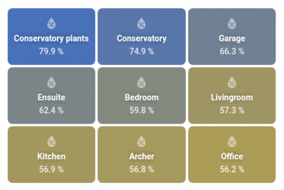
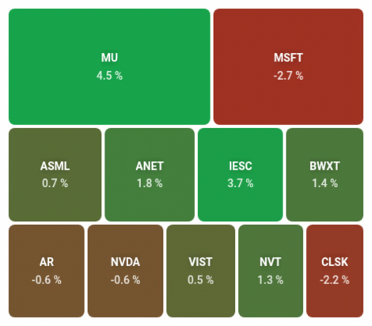

# Treemap Card for Home Assistant

Visualize data as a treemap - like Finviz stock heatmaps. Rectangle sizes show relative values, colors indicate status.




## Installation

### HACS

1. Go to HACS > Frontend > Custom repositories
2. Add `https://github.com/omachala/ha-treemap-card`
3. Install "Treemap Card" and refresh browser

### Manual

Download `treemap-card.js` from [releases](https://github.com/omachala/ha-treemap-card/releases) to `config/www/`, then add as resource: `/local/treemap-card.js`

## Two Modes

### Entities Mode

Use `entities` to display HA entities directly. Supports wildcards.

```yaml
type: custom:treemap-card
title: Humidity
entities:
  - sensor.*_humidity
height: 300
size:
  equal: true
filter:
  above: 0
  below: 100
color:
  high: '#1157f0'
  low: '#f0b913'
  scale:
    neutral: 60
    min: 50
    max: 100
label:
  replace: ' Humidity$//'
value:
  suffix: ' %'
```

### JSON Attribute Mode

Use `entity` to read an array of objects from an entity attribute. Map any fields to label, value, size, color.

```yaml
type: custom:treemap-card
entity: sensor.trading_portfolio_holdings
data_attribute: holdings
label:
  param: ticker
value:
  param: todayPct
  suffix: ' %'
size:
  param: value
color:
  low: '#b91c1c'
  high: '#16a34a'
  scale:
    neutral: 0
    min: -4
    max: 4
height: 400
```

## Configuration

### Data Source

<table width="100%">
<tr><th>Option</th><th>Default</th><th>Description</th></tr>
<tr><td><code>entity</code></td><td></td><td>Single entity ID that has an array of objects in its attributes. Use this when you have a custom sensor that outputs structured data like <code>[{label: "A", value: 10}, ...]</code></td></tr>
<tr><td><code>entities</code></td><td></td><td>List of entity IDs. Supports <code>*</code> wildcards like <code>sensor.*_humidity</code> to match multiple sensors. Each entity becomes one rectangle.</td></tr>
<tr><td><code>data_attribute</code></td><td><code>items</code></td><td>Which attribute contains your array. If your sensor has <code>attributes.holdings = [{...}]</code>, set this to <code>holdings</code>.</td></tr>
</table>

### Label

Controls what text appears on each rectangle.

<table width="100%">
<tr><th>Option</th><th>Default</th><th>Description</th></tr>
<tr><td><code>label.param</code></td><td><code>label</code></td><td>Which field from your data to use as the label. If your objects look like <code>{name: "Kitchen", temp: 22}</code>, set this to <code>name</code>.</td></tr>
<tr><td><code>label.show</code></td><td><code>true</code></td><td>Set to <code>false</code> to hide labels completely.</td></tr>
<tr><td><code>label.prefix</code></td><td></td><td>Text to add before every label. <code>prefix: "Room: "</code> turns "Kitchen" into "Room: Kitchen".</td></tr>
<tr><td><code>label.suffix</code></td><td></td><td>Text to add after every label.</td></tr>
<tr><td><code>label.replace</code></td><td></td><td>Regex to clean up labels. Format: <code>pattern/replacement/flags</code>. Example: <code> Humidity$//</code> removes " Humidity" suffix from "Kitchen Humidity".</td></tr>
</table>

### Value

Controls the number displayed on each rectangle.

<table width="100%">
<tr><th>Option</th><th>Default</th><th>Description</th></tr>
<tr><td><code>value.param</code></td><td><code>value</code></td><td>Which field to display. If your objects have <code>{temp: 22, humidity: 65}</code> and you want to show humidity, set this to <code>humidity</code>.</td></tr>
<tr><td><code>value.show</code></td><td><code>true</code></td><td>Set to <code>false</code> to hide values, showing only labels.</td></tr>
<tr><td><code>value.prefix</code></td><td></td><td>Text before the value. <code>prefix: "$"</code> shows "$100" instead of "100".</td></tr>
<tr><td><code>value.suffix</code></td><td></td><td>Text after the value. <code>suffix: " %"</code> shows "65 %" instead of "65".</td></tr>
</table>

### Size

Controls how big each rectangle is relative to others.

<table width="100%">
<tr><th>Option</th><th>Default</th><th>Description</th></tr>
<tr><td><code>size.param</code></td><td>same as <code>value.param</code></td><td>Which field determines rectangle size. For a stock portfolio, you might display <code>todayPct</code> (daily change) but size by <code>value</code> (position size), so bigger positions get bigger rectangles.</td></tr>
<tr><td><code>size.equal</code></td><td><code>false</code></td><td>Set to <code>true</code> for uniform grid - all rectangles same size. Useful when you only care about color differences, like comparing room temperatures.</td></tr>
</table>

### Color

Controls the color gradient from low to high values.

<table width="100%">
<tr><th>Option</th><th>Default</th><th>Description</th></tr>
<tr><td><code>color.low</code></td><td><code>#b91c1c</code> (red)</td><td>Color for the lowest values.</td></tr>
<tr><td><code>color.high</code></td><td><code>#16a34a</code> (green)</td><td>Color for the highest values.</td></tr>
<tr><td><code>color.scale.neutral</code></td><td></td><td>The value that should appear gray/neutral. For profit/loss, set to <code>0</code> so gains are green and losses are red. For humidity, set to <code>60</code> if that's your ideal level.</td></tr>
<tr><td><code>color.scale.min</code></td><td>auto (data min)</td><td>Values at or below this get full <code>color.low</code>. Example: set to <code>-5</code> and anything -5% or worse shows as full red, preventing one extreme value from washing out all other colors.</td></tr>
<tr><td><code>color.scale.max</code></td><td>auto (data max)</td><td>Values at or above this get full <code>color.high</code>. Example: set to <code>5</code> and anything +5% or better shows as full green.</td></tr>
<tr><td><code>color_param</code></td><td>same as <code>value.param</code></td><td>Which field to use for coloring. Useful when you display one thing but color by another - show temperature but color by how far from target.</td></tr>
</table>

### Filter

Exclude items from the treemap based on their value.

<table width="100%">
<tr><th>Option</th><th>Description</th></tr>
<tr><td><code>filter.above</code></td><td>Only show items with value greater than this. <code>above: 0</code> hides zero and negative values - useful for filtering out "unavailable" sensors that report 0.</td></tr>
<tr><td><code>filter.below</code></td><td>Only show items with value less than this. <code>below: 100</code> combined with <code>above: 0</code> keeps only valid percentage values (1-99), filtering out sensors reporting 0 or 100 due to errors.</td></tr>
</table>

### Layout

<table width="100%">
<tr><th>Option</th><th>Default</th><th>Description</th></tr>
<tr><td><code>title</code></td><td></td><td>Card title shown at the top.</td></tr>
<tr><td><code>height</code></td><td>auto</td><td>Fixed height in pixels. Auto-height calculates based on item count. Set explicitly like <code>height: 300</code> for consistent sizing.</td></tr>
<tr><td><code>gap</code></td><td><code>6</code></td><td>Space between rectangles in pixels. Set to <code>0</code> for no gaps, increase for more breathing room.</td></tr>
</table>

### Entities Mode Only

These only apply when using `entities` (not `entity`).

<table width="100%">
<tr><th>Option</th><th>Default</th><th>Description</th></tr>
<tr><td><code>value_attribute</code></td><td><code>state</code></td><td>Which entity attribute to use as value. Default uses the entity's state. Set to an attribute name like <code>battery_level</code> to use that instead.</td></tr>
<tr><td><code>label_attribute</code></td><td><code>friendly_name</code></td><td>Which entity attribute to use as label. Default uses friendly name from HA.</td></tr>
<tr><td><code>icon.param</code></td><td><code>icon</code></td><td>Field containing MDI icon name like <code>mdi:thermometer</code>.</td></tr>
<tr><td><code>icon.show</code></td><td><code>true</code></td><td>Set to <code>false</code> to hide icons.</td></tr>
</table>

## License

MIT
