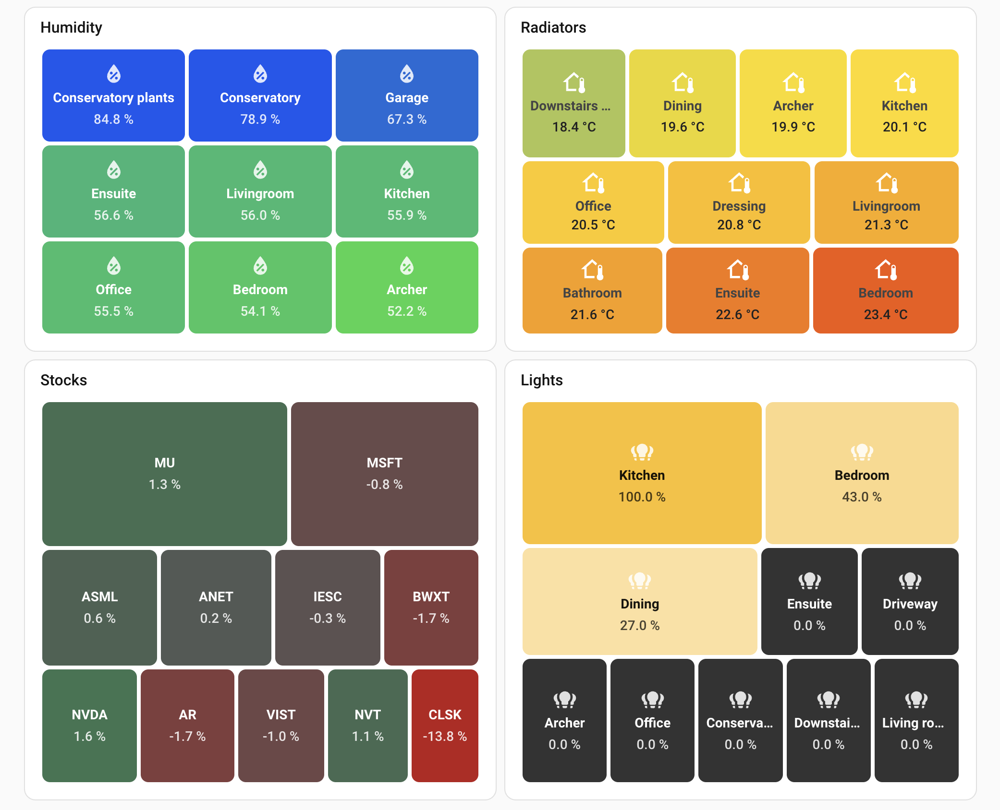

# Treemap Card for Home Assistant

Visualize data as a treemap - like Finviz stock heatmaps. Rectangle sizes show relative values, colors indicate status.



## Installation

### HACS

1. Go to HACS > Frontend > Custom repositories
2. Add `https://github.com/omachala/ha-treemap-card`
3. Install "Treemap Card" and refresh browser

### Manual

Download `treemap-card.js` from [releases](https://github.com/omachala/ha-treemap-card/releases) to `config/www/`, then add as resource: `/local/treemap-card.js`

## Two Modes

### Entities Mode

Use `entities` to display HA entities directly. Supports wildcards.

```yaml
type: custom:treemap-card
title: Humidity
entities:
  - sensor.*_humidity
exclude:
  - sensor.*target*
height: 300
gap: 4
size:
  equal: true
filter:
  above: 0
  below: 100
color:
  low: '#f0b913'
  high: '#1157f0'
  opacity: 0.9
  scale:
    neutral: 60
    min: 50
    max: 100
label:
  show: true
  attribute: friendly_name
  replace: ' Humidity$//'
  suffix: ' (room)'
  style: |
    text-shadow: 0 0 5px rgba(0,0,0,0.3);
value:
  attribute: state
  suffix: ' %'
  style: |
    font-weight: bold;
icon:
  show: true
  icon: mdi:water-percent
  style: |
    opacity: 0.8;
card_style: |
  border-radius: 12px;
```

### JSON Attribute Mode

Use `entity` to read an array of objects from an entity attribute. Map any fields to label, value, size, color.

```yaml
type: custom:treemap-card
header:
  show: true
  title: Portfolio
  style: |
    font-size: 16px;
    padding: 8px 16px;
entity: sensor.trading_portfolio_holdings
data_attribute: holdings
label:
  param: ticker
  prefix: '$'
value:
  show: true
  param: todayPct
  prefix: '+'
  suffix: ' %'
size:
  param: value
  inverse: false
color:
  low: '#b91c1c'
  mid: '#fbbf24'
  high: '#16a34a'
  param: todayPct
  scale:
    neutral: 0
    min: -4
    max: 4
icon:
  param: icon
height: 400
order: desc
limit: 10
```

## Configuration

### Data Source

<table width="100%">
<tr><th>Option</th><th>Default</th><th>Description</th></tr>
<tr><td><code>entity</code></td><td></td><td>Single entity ID that has an array of objects in its attributes. Use this when you have a custom sensor that outputs structured data like <code>[{label: "A", value: 10}, ...]</code></td></tr>
<tr><td><code>entities</code></td><td></td><td>List of entity IDs. Supports <code>*</code> wildcards like <code>sensor.*_humidity</code> to match multiple sensors. Each entity becomes one rectangle.</td></tr>
<tr><td><code>exclude</code></td><td></td><td>List of entity patterns to exclude. Supports <code>*</code> wildcards. Example: <code>exclude: [sensor.*target*, sensor.*boost*]</code> removes matching entities.</td></tr>
<tr><td><code>data_attribute</code></td><td><code>items</code></td><td>Which attribute contains your array. If your sensor has <code>attributes.holdings = [{...}]</code>, set this to <code>holdings</code>.</td></tr>
</table>

### Label

Controls what text appears on each rectangle.

<table width="100%">
<tr><th>Option</th><th>Default</th><th>Description</th></tr>
<tr><td><code>label.show</code></td><td><code>true</code></td><td>Set to <code>false</code> to hide labels completely.</td></tr>
<tr><td><code>label.param</code></td><td><code>label</code></td><td><strong>JSON mode only.</strong> Which field from your data to use as the label. If your objects look like <code>{name: "Kitchen", temp: 22}</code>, set this to <code>name</code>.</td></tr>
<tr><td><code>label.attribute</code></td><td><code>friendly_name</code></td><td><strong>Entities mode only.</strong> Which entity attribute to use as label. Common values: <code>friendly_name</code> (human-readable name like "Kitchen Humidity"), <code>entity_id</code> (raw ID like "sensor.kitchen_humidity"), <code>device_class</code> (type like "humidity", "temperature").</td></tr>
<tr><td><code>label.replace</code></td><td></td><td>Regex to clean up labels. Format: <code>pattern/replacement/flags</code>. Example: <code> Humidity$//</code> removes " Humidity" suffix from "Kitchen Humidity".</td></tr>
<tr><td><code>label.prefix</code></td><td></td><td>Text to add before every label. <code>prefix: "Room: "</code> turns "Kitchen" into "Room: Kitchen".</td></tr>
<tr><td><code>label.suffix</code></td><td></td><td>Text to add after every label.</td></tr>
</table>

### Value

Controls the number displayed on each rectangle.

<table width="100%">
<tr><th>Option</th><th>Default</th><th>Description</th></tr>
<tr><td><code>value.show</code></td><td><code>true</code></td><td>Set to <code>false</code> to hide values, showing only labels.</td></tr>
<tr><td><code>value.param</code></td><td><code>value</code></td><td><strong>JSON mode only.</strong> Which field to display. If your objects have <code>{temp: 22, humidity: 65}</code> and you want to show humidity, set this to <code>humidity</code>.</td></tr>
<tr><td><code>value.attribute</code></td><td><code>state</code></td><td><strong>Entities mode only.</strong> Which entity attribute to use as value. Common values: <code>state</code> (main entity value), <code>battery_level</code>, <code>brightness</code>, <code>temperature</code>, <code>humidity</code>, <code>current_position</code> (blinds), <code>volume_level</code> (media players).</td></tr>
<tr><td><code>value.prefix</code></td><td></td><td>Text before the value. <code>prefix: "$"</code> shows "$100" instead of "100".</td></tr>
<tr><td><code>value.suffix</code></td><td></td><td>Text after the value. <code>suffix: " %"</code> shows "65 %" instead of "65".</td></tr>
</table>

### Size & Order

**Size** controls how big each rectangle is. **Order** controls where it appears (top-left = first).

| What you want                                  | Configuration                        |
| ---------------------------------------------- | ------------------------------------ |
| Biggest values = biggest squares, shown first  | `order: desc` (default)              |
| Biggest values = biggest squares, shown last   | `order: asc`                         |
| Smallest values = biggest squares, shown first | `order: desc` + `size.inverse: true` |
| Smallest values = biggest squares, shown last  | `order: asc` + `size.inverse: true`  |
| All squares same size                          | `size.equal: true`                   |

**Example: Room temperatures**

Show coldest rooms first with bigger squares (to highlight rooms that need heating):

```yaml
order: asc
size:
  inverse: true
```

**Example: Stock portfolio**

Show biggest positions first (default), sized by dollar value, colored by daily change:

```yaml
order: desc
size:
  param: value
value:
  param: todayPct
color:
  param: todayPct
```

<table width="100%">
<tr><th>Option</th><th>Default</th><th>Description</th></tr>
<tr><td><code>size.param</code></td><td>same as <code>value.param</code></td><td>Which field determines rectangle size. For a stock portfolio, you might display <code>todayPct</code> (daily change) but size by <code>value</code> (position size), so bigger positions get bigger rectangles.</td></tr>
<tr><td><code>size.equal</code></td><td><code>false</code></td><td>Set to <code>true</code> for uniform grid - all rectangles same size. Useful when you only care about color differences, like comparing room temperatures.</td></tr>
<tr><td><code>size.inverse</code></td><td><code>false</code></td><td>Set to <code>true</code> to invert sizing - low values get bigger rectangles. Useful when lower is better (e.g., response times, error rates).</td></tr>
<tr><td><code>order</code></td><td><code>desc</code></td><td>Position order: <code>desc</code> puts largest values first (top-left), <code>asc</code> puts smallest first. This only affects position, not size.</td></tr>
</table>

### Icon

<table width="100%">
<tr><th>Option</th><th>Default</th><th>Description</th></tr>
<tr><td><code>icon.show</code></td><td><code>true</code></td><td>Set to <code>false</code> to hide icons.</td></tr>
<tr><td><code>icon.icon</code></td><td></td><td>Static icon for all items. Example: <code>icon: mdi:thermometer</code> shows thermometer on every rectangle regardless of entity icons.</td></tr>
<tr><td><code>icon.param</code></td><td><code>icon</code></td><td>Field containing MDI icon name (JSON mode only).</td></tr>
</table>

### Color

Imagine a temperature treemap: you want 20°C to feel "neutral" (yellow), colder rooms trending blue, warmer rooms trending red. Set `neutral: 20` and `mid: '#f0b913'` (yellow). Now rooms at 15°C show blue-ish, 25°C show orange-ish, and 20°C is pure yellow.

But what if one room is 5°C and another is 35°C? Without limits, those extremes stretch your color scale so much that 18°C and 22°C look almost identical. Fix this with `scale.min: 10` and `scale.max: 30` - now anything below 10°C is full blue, anything above 30°C is full red, and the colors between are properly spread out.

<table width="100%">
<tr><th>Option</th><th>Default</th><th>Description</th></tr>
<tr><td><code>color.low</code></td><td><code>#b91c1c</code> (red)</td><td>Color for the lowest values.</td></tr>
<tr><td><code>color.mid</code></td><td></td><td>Optional color for middle/neutral values. When set, creates a three-color gradient: <code>low -> mid -> high</code>. Example: <code>#00b6ed</code> (blue) for a red-blue-green gradient. The mid color appears at <code>scale.neutral</code> if set, otherwise at the center of the data range.</td></tr>
<tr><td><code>color.high</code></td><td><code>#16a34a</code> (green)</td><td>Color for the highest values.</td></tr>
<tr><td><code>color.opacity</code></td><td><code>1</code></td><td>Opacity from 0 to 1. Set to <code>0.5</code> for 50% transparency - useful when you have a background image or want softer colors.</td></tr>
<tr><td><code>color.param</code></td><td>same as <code>value.param</code></td><td>Which field to use for coloring. Useful when you display one thing but color by another.</td></tr>
<tr><td><code>color.scale.neutral</code></td><td></td><td>The value where <code>color.mid</code> appears (or the blend point if no mid color). For profit/loss, set to <code>0</code> so gains are green and losses are red. For humidity, set to <code>60</code> if that's your ideal level.</td></tr>
<tr><td><code>color.scale.min</code></td><td>auto (data min)</td><td>Values at or below this get full <code>color.low</code>. Example: set to <code>-5</code> and anything -5% or worse shows as full red, preventing one extreme value from washing out all other colors.</td></tr>
<tr><td><code>color.scale.max</code></td><td>auto (data max)</td><td>Values at or above this get full <code>color.high</code>. Example: set to <code>5</code> and anything +5% or better shows as full green.</td></tr>
</table>

### Filter

Exclude items from the treemap based on their value.

<table width="100%">
<tr><th>Option</th><th>Description</th></tr>
<tr><td><code>filter.above</code></td><td>Only show items with value greater than this. <code>above: 0</code> hides zero and negative values - useful for filtering out "unavailable" sensors that report 0.</td></tr>
<tr><td><code>filter.below</code></td><td>Only show items with value less than this. <code>below: 100</code> combined with <code>above: 0</code> keeps only valid percentage values (1-99), filtering out sensors reporting 0 or 100 due to errors.</td></tr>
</table>

### Layout

<table width="100%">
<tr><th>Option</th><th>Default</th><th>Description</th></tr>
<tr><td><code>height</code></td><td>auto</td><td>Fixed height in pixels. Auto-height calculates based on item count. Set explicitly like <code>height: 300</code> for consistent sizing.</td></tr>
<tr><td><code>gap</code></td><td><code>6</code></td><td>Space between rectangles in pixels. Set to <code>0</code> for no gaps, increase for more breathing room.</td></tr>
<tr><td><code>limit</code></td><td></td><td>Maximum number of items to show. Combined with <code>order: desc</code>, <code>limit: 10</code> shows top 10 largest.</td></tr>
</table>

### Title vs Header

Two ways to add a title - use one or the other, not both:

**`title`** - Uses Home Assistant's built-in card header. Consistent with other HA cards, but no customization options.

```yaml
title: Humidity
```

**`header`** - Custom compact header with full styling control. Takes less vertical space than HA's default.

```yaml
header:
  title: Humidity
  style: |
    font-size: 14px;
    padding: 4px 16px;
```

If both are set, `header.title` takes precedence and `title` is ignored.

### Styling

Customize the appearance with inline CSS. All style options accept multiline YAML strings.

```yaml
header:
  title: My Treemap
  style: |
    font-size: 20px;
    color: red;
label:
  style: |
    text-shadow: 0 0 10px rgba(0,0,0,0.5);
value:
  style: |
    font-size: 18px;
    font-weight: bold;
icon:
  style: |
    opacity: 0.8;
card_style: |
  background: transparent;
```

<table width="100%">
<tr><th>Option</th><th>Description</th></tr>
<tr><td><code>header.show</code></td><td>Show or hide custom header. Default: <code>true</code> if <code>header.title</code> is set.</td></tr>
<tr><td><code>header.title</code></td><td>Custom header text. More compact than HA's default <code>title</code>.</td></tr>
<tr><td><code>header.style</code></td><td>CSS for the custom header. Example: <code>font-size: 14px; padding: 4px 16px;</code></td></tr>
<tr><td><code>label.style</code></td><td>CSS for labels. Example: <code>text-shadow: 0 0 10px rgba(0,0,0,0.3);</code></td></tr>
<tr><td><code>value.style</code></td><td>CSS for values. Example: <code>font-size: 18px;</code></td></tr>
<tr><td><code>icon.style</code></td><td>CSS for icons. Example: <code>color: white; opacity: 0.8;</code></td></tr>
<tr><td><code>card_style</code></td><td>CSS for the entire card. Example: <code>background: transparent;</code></td></tr>
</table>

## License

MIT

---

<p align="center">
Made with :heart: in London - yes, those humidity readings in the screenshot are real.
</p>
